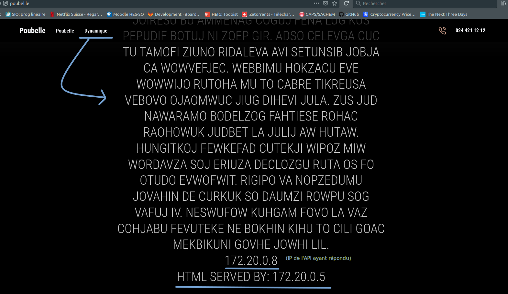

# RES_LABO4
## Étapes et répertoires. 
Pour chaque étape implémentée, vous trouverez ci-dessous le répertoire associé. On espère que ça vous simplifiera un peu les choses :wink:

| Étape                                          | Répertoire                                                                                       |
|------------------------------------------------|--------------------------------------------------------------------------------------------------|
| 1. Serveur HTTP statique                       | [apache-php-image](docker-images/apache-php-image/)                                              |
| 2. Serveur HTTP dynamique (express)            | [express-image](docker-images/express-image/)                                                    |
| 3. Reverse proxy apache                        | [reverse-proxy-v1](docker-images/reverse-proxy-v1)                                               |
| 4. Requetes AJAX                               | [apache-php-image/src/assets/js/posts.js](docker-images/apache-php-image/src/assets/js/posts.js) |
| 5. Reverse proxy dynamique                     | [reverse-proxy-v2](docker-images/reverse-proxy-v2)                                               |
| Bonus 1. Load balancing : multiple serveurs    | [reverse-proxy-traefik](docker-images/reverse-proxy-traefik/)                                    |
| Bonus 2. Load balancing : rr vs sticky session | TODO                                                                                             |
| Bonus 3. Gestionnaire de cluster dynamique     | TODO                                                                                             |
| Bonus 4. Gestionnaire UI                       | [portainer](docker-images/portainer/)                                                            |

## Prérequis :
- Docker (version 20.10.6)

Veuillez noter que nous éditons notre fichier *etc/hosts* afin de pouvoir associer notre nom de domaine **poubel.le** à localhost. À priori, utiliser **localhost** devrait aboutir aux mêmes résultats.

## Étape 1. Serveur HTTP statique. 

Cette étape a pour but de mettre en place uns erveur apache httpd servant du contenu via le protocole HTTP. Notre serveur HTTP est dockerisé et utilise l'image de base [php](https://hub.docker.com/_/php). 

**Mais Jamy, comment on lance notre container Docker ?** :cold_sweat:
Rien de plus facile ! Rendez-vous dans le répertorie [apache-php-image](docker-images/apache-php-image), build l'image et lancer le container ! 
```bash
cd docker-images/apache-php-image
docker build -t poubelle/apache-php .
docker run -p 8080:80 poubelle/apache-php
```
Notons que nous mappons le port 8080 (accessible depuis le navigateur). 

Et en vous rendant à l'adresse [localhost:8080](localhost:8080), le serveur *devrait* tourner et servir une page web statique ! 

## Étape 2. Serveur HTTP dynamique. 
Dans cette étape, nous mettons en place une application [Express.js](https://expressjs.com/) dont le comportement, à l'instar d'une API retourne un JSON de données pour une requête GET. 
Nous utilisons également la librairie [Chance](https://www.npmjs.com/package/chance) pour générer du contenu aléatoire. Ces deux librairies sont installées via le gestionnaire de paquet NodeJS [NPM](https://www.npmjs.com/). 
Vous trouverez la configuration minimale du projet dans le fichier [`package.json`](docker-images/express-image/src/package.json). 
Notons que nous utilisons la version 1.1.7 (ou compatible) pour Chance et la version 4.17.1 (ou compatible) pour express.
```json
{
   ... 
  "dependencies": {
    "chance": "^1.1.7",
    "express": "^4.17.1"
  }
}
```

Notre mini-API ne possède qu'une seule route :

- GET / : retourne une liste de posts aléatoires. 

Pour **lancer le container Docker**, vous pouvez utiliser les commandes suivantes.

```bash
cd docker-images/express-image
docker build -t poubelle/express .
docker run -p 9090:3000 poubelle/express

```
Format de réponse du serveur express: 
```json
{
   "data":[
      {
         "title":"...",
         "author":"Isaiah Perry",
         "comments":[
            {
               "comment":"...",
               "author":"Lottie French",
               "date":"2089-09-21T19:38:00.626Z"
            },
            {
               "comment":"...",
               "author":"Hester Perez",
               "date":"2035-06-06T23:36:12.821Z"
            }
         ]
      }
   ],
   "serverIp":"172.17.0.2"
}
```
Veuillez noter que le serveur nous renvoie en fin réponse son adresse IP. On utilisera cette information un peu plus tard.

Ainsi, une simple requête netcat devrait permettre de retrouver des informations du serveur.
```bash
nc localhost 9090
GET / HTTP/1.1 CRLF CRLF
```

## Étape 3. Reverse proxy apache. 
  
Nous allons maintenant mettre en place un reverse proxy afin d'avoir un point d'entrée unique à notre architecture de serveurs. Ce reserve proxy est également mis en place via un container Docker.

```bash
docker run poubelle/apache-php
docker run poubelle/express
docker build -t poubelle/express-proxyv1 .
docker run -p 8080:80 poubelle/proxyv1
```

## Étape 4. Requête AJAX. 

Nous allons maintenant utiliser [JQuery](https://jquery.com/) afin de faire une requête AJAX !


## Étape 5. Reverse proxy dynamique. 


## Bonus #1 & #2. Load balancing round-robin & sticky sessions.
Dans cette étape, nous étendons notre infrastructure avec du loadbalancing. Pour ce faire, nous avons décidé d'utiliser l'outil [Traefik](https://doc.traefik.io/traefik/) comme reverse proxy. Nous avons donc délaissé notre version fait maison réalisée lors des étapes précédentes.

`Traefik`, dans notre cas, se présente sous la forme d'un container docker qui se chargera de lancer elle-même les différents service de notre infrastructure, autrement dit notre application front-end (le site static) et notre application Express (générant du contenu "dynamique"), dans des containers. 

Pour lancer notre reverse proxy avec du load balancing, il suffit de se diriger dans le dossier `./docker-iamges/reverse-proxy-traefik` et de lancer la commandes:
```bash
docker-compose up --scale express=<NB_EXPRESS_INSTANCE> --scale apache=<NB_APACHE_INSTANCE>
```
Il faut bien évidemment remplacer `NB_EXPRESS_INSTANCE` & `NB_APACHE_INSTANCE` par le nombre d'instance souhaité par service. 

Les configurations de notre reverse proxy sont présentes dans le fichier de configuration yaml `docker-compose.yaml` présent dans le même dossier.

Il faut noter que `Traefik` utilise par défaut l'algorithme `round-robin` pour distribuer les requêtes vers nos services. Mais notre configuration actuel lui fait utilisé le `sticky-session`. Pour réactiver le round-robin, il suffit d'éditer le fichier de configuration `docker-compose.yaml` en commentant les lignes suivantes:

```yaml
#...
    apache:
        image: "poubelle/apache-php"
        labels:
           - ...
           # - "traefik.http.services.apache.loadBalancer.sticky.cookie=true"                   <=== ICI
           # - "traefik.http.services.apache.loadBalancer.sticky.cookie.name=sticky-apache"     <=== LA
            
    express:
        image: "poubelle/express"
        labels:
           -  ...
            #- "traefik.http.services.express.loadBalancer.sticky.cookie=true"                  <=== ICI EGALEMENT
            #- "traefik.http.services.express.loadBalancer.sticky.cookie.name=sticky-express"   <=== ET ENCORE LA 

```

### Test du Round-robin
Afin de tester le round-robin, il suffit de lancer le reverse-proxy avec les commandes susmentionnées et de se diriger vers notre magnifique site: `http://poubel.le`. Puis, de se déplacer dans la section dynamique. Cette dernière récupère et affiche à intervalle de 5 secondes les données générée par l'API mais encore l'adresse ip de l'API ayant répondu ainsi que celle du serveur apache(& php) ayant fourni le front-end(HTML). Il suffit donc d'observer que à chaque réponse de la requête AJAX reçu, l'adresse ip de l'application Express change. En ce qui concerne l'adresse ip du serveur apache, il suffit de raffraichir le site pour voir l'adresse ip changée. 




### Test du Sticky-session
Pour valider cette partie, même principe que pour le test du round-robin, les observations cependant diffèrent. l'adresse ip du serveur ainsi que celle du serveur apache ne changent pas. Pour les voir changer, il suffit de supprimer les cookies `sticky-express` & `sticky-apache` et de rafraichir la page. Ou, plus simplement lancé une session de navigation privé et de retourner sur le site (ATTENTION pour les voir changer plusieurs fois avec la navigation privée, il faudra refermer à chaque fois la session privé précédente).

## Bonus #3 Dynamic cluster management
Nous n'avons pas effectuer plus de configuration avec `Traefik` pour cette partie. Cependant, il semble le gérer plus ou moins de base. Si on essaie de supprimer une machine utilise par le reverse-proxy. Ce dernier ne s'en sert plus pour les requêtes futures.

## Bonus #4 Management UI
TODO 
