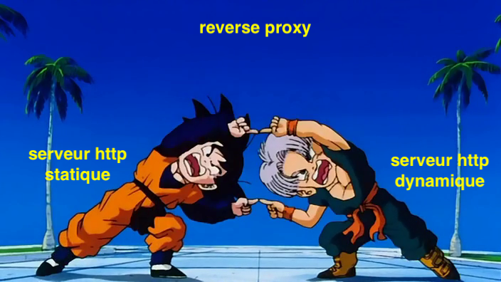

# RES_LABO4
## Étapes et répertoires  

Pour chaque étape implémentée, vous trouverez ci-dessous le répertoire associé. On espère que ça vous simplifiera un peu les choses :wink:

| Étape                                          | Répertoire                                                                                       |
|------------------------------------------------|--------------------------------------------------------------------------------------------------|
| 1. Serveur HTTP statique                       | [apache-php-image](docker-images/apache-php-image/)                                              |
| 2. Serveur HTTP dynamique (express)            | [express-image](docker-images/express-image/)                                                    |
| 3. Reverse proxy apache                        | [reverse-proxy-v1](docker-images/reverse-proxy-v1)                                               |
| 4. Requetes AJAX                               | [apache-php-image/src/assets/js/posts.js](docker-images/apache-php-image/src/assets/js/posts.js) |
| 5. Reverse proxy dynamique                     | [reverse-proxy-v2](docker-images/reverse-proxy-v2)                                               |
| Bonus 1. Load balancing : multiple serveurs    | [reverse-proxy-traefik](docker-images/reverse-proxy-traefik/)                                    |
| Bonus 2. Load balancing : rr vs sticky session | TODO                                                                                             |
| Bonus 3. Gestionnaire de cluster dynamique     | TODO                                                                                             |
| Bonus 4. Gestionnaire UI                       | [portainer](docker-images/portainer/)                                                            |

## Prérequis :
- Docker (version 20.10.6)

Veuillez noter que nous éditons notre fichier *etc/hosts* afin de pouvoir associer notre nom de domaine **poubel.le** à localhost. À priori, utiliser **localhost** devrait aboutir aux mêmes résultats.

## Étape 1. Serveur HTTP statique  
Cette étape a pour but de mettre en place uns erveur apache httpd servant du contenu via le protocole HTTP. Notre serveur HTTP est dockerisé et utilise l'image de base [php](https://hub.docker.com/_/php). 

**Mais Jamy, comment on lance notre container Docker ?** :cold_sweat:
Rien de plus facile ! Rendez-vous dans le répertorie [apache-php-image](docker-images/apache-php-image), build l'image et lancer le container ! 
```bash
cd docker-images/apache-php-image
docker build -t poubelle/apache-php .
docker run -p 8080:80 poubelle/apache-php
```
Notons que nous mappons le port 8080 (accessible depuis le navigateur). 

Et en vous rendant à l'adresse [localhost:8080](localhost:8080), le serveur *devrait* tourner et servir une page web statique ! 

## Étape 2. Serveur HTTP dynamique
Dans cette étape, nous mettons en place une application [Express.js](https://expressjs.com/) dont le comportement, à l'instar d'une API retourne un JSON de données pour une requête GET. 
Nous utilisons également la librairie [Chance](https://www.npmjs.com/package/chance) pour générer du contenu aléatoire. Ces deux librairies sont installées via le gestionnaire de paquet NodeJS [NPM](https://www.npmjs.com/). 
Vous trouverez la configuration minimale du projet dans le fichier [`package.json`](docker-images/express-image/src/package.json). 
Notons que nous utilisons la version 1.1.7 (ou compatible) pour Chance et la version 4.17.1 (ou compatible) pour express.
```json
{
   ... 
  "dependencies": {
    "chance": "^1.1.7",
    "express": "^4.17.1"
  }
}
```

Notre mini-API ne possède qu'une seule route :

- GET / : retourne une liste de posts aléatoires. 

Pour **lancer le container Docker**, vous pouvez utiliser les commandes suivantes.

```bash
cd docker-images/express-image
docker build -t poubelle/express .
docker run -p 9090:3000 poubelle/express

```
Format de réponse du serveur express: 
```json
{
   "data":[
      {
         "title":"...",
         "author":"Isaiah Perry",
         "comments":[
            {
               "comment":"...",
               "author":"Lottie French",
               "date":"2089-09-21T19:38:00.626Z"
            },
            {
               "comment":"...",
               "author":"Hester Perez",
               "date":"2035-06-06T23:36:12.821Z"
            }
         ]
      }
   ],
   "serverIp":"172.17.0.2"
}
```
Veuillez noter que le serveur nous renvoie en fin réponse son adresse IP. On utilisera cette information un peu plus tard.

Ainsi, une simple requête netcat devrait permettre de retrouver des informations du serveur.
```bash
nc localhost 9090
GET / HTTP/1.1 CRLF CRLF
```

## Étape 3. Reverse proxy apache  

Nous allons maintenant mettre en place un reverse proxy afin d'avoir un point d'entrée unique à notre architecture de serveurs. Ce reserve proxy est également mis en place via un container Docker.

```bash
cd docker-images/reverse-proxy-v1
docker build -t poubelle/proxyv1 .
docker run -p 8080:80 poubelle/proxyv1
```
**TODO: à finir! **

## Étape 4. Requête AJAX
Nous allons maintenant utiliser [JQuery](https://jquery.com/) afin de faire une requête AJAX ! 


## Étape 5. Reverse proxy dynamique  